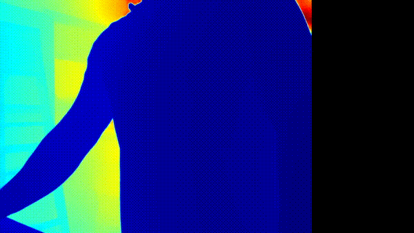

# Depth Perception with ML-Depth Pro 🚀

## Overview
This repository expands upon [Apple's ML-Depth Pro](https://github.com/apple/ml-depth-pro/tree/main) to showcase depth perception in images and real-time video feeds using a standard webcam. Goal was to simply explore the capabiliyt of depth pro to use in a live feed. 
## Demo



## Features
- **Live video integration:** Real-time depth perception with a live feed.

## Getting Started

### Prerequisites
- CUDA 
- Miniconda
- Python 3.9
- PyTorch
- OpenCV
- Additional libraries

### Installation
1. Clone this repository:
   ```bash
   git clone https://github.com/MadMando/ml-depth-pro_video.git
   ```
2. Navigate to the repository directory. 
   ```bash
   cd ml-depth-pro_video
   ```
3. Create Env.
   ```bash
   conda create -n depth-pro -y python=3.9

   conda activate depth-pro
   ```
   
4.  Install Requiremetns
   ```bash
   pip install -e .
   ```
4a.  Run to download checkpoints
   ```bash
   download-file
   ```
5. install other requirements
   ```bash
   pip install torch torchvision torchaudio --index-url https://download.pytorch.org/whl/cu118
   ```
   
### Hardware 
NVIDIA RTX4080 Super

Webcam - NEXIGO N680

Set to device 0
### Usage

1. Start the live feed, depending on your hardware should take less than a minute
   ```bash
   python depth_video.py
   ```

## Acknowledgements
This project builds upon the [ML-Depth Pro repository](https://github.com/apple/ml-depth-pro/tree/main) developed by Apple Inc. I would like to acknowledge the fantastic work of Apple's Machine Learning team in creating the original model.
## Reference 
```bibtex
@article{Bochkovskii2024:arxiv,
  author     = {Aleksei Bochkovskii and Ama\"{e}l Delaunoy and Hugo Germain and Marcel Santos and
               Yichao Zhou and Stephan R. Richter and Vladlen Koltun}
  title      = {Depth Pro: Sharp Monocular Metric Depth in Less Than a Second},
  journal    = {arXiv},
  year       = {2024},
  url        = {https://arxiv.org/abs/2410.02073},
}
```
### License
This project incorporates software provided by Apple Inc., which is licensed under the following terms:

```
Copyright (C) 2024 Apple Inc. All Rights Reserved.

Disclaimer: IMPORTANT:  This Apple software is supplied to you by Apple
Inc. ("Apple") in consideration of your agreement to the following
terms, and your use, installation, modification or redistribution of
this Apple software constitutes acceptance of these terms.  If you do
not agree with these terms, please do not use, install, modify or
redistribute this Apple software.

In consideration of your agreement to abide by the following terms, and
subject to these terms, Apple grants you a personal, non-exclusive
license, under Apple's copyrights in this original Apple software (the
"Apple Software"), to use, reproduce, modify and redistribute the Apple
Software, with or without modifications, in source and/or binary forms;
provided that if you redistribute the Apple Software in its entirety and
without modifications, you must retain this notice and the following
text and disclaimers in all such redistributions of the Apple Software.
Neither the name, trademarks, service marks or logos of Apple Inc. may
be used to endorse or promote products derived from the Apple Software
without specific prior written permission from Apple.  Except as
expressly stated in this notice, no other rights or licenses, express or
implied, are granted by Apple herein, including but not limited to any
patent rights that may be infringed by your derivative works or by other
works in which the Apple Software may be incorporated.

The Apple Software is provided by Apple on an "AS IS" basis.  APPLE
MAKES NO WARRANTIES, EXPRESS OR IMPLIED, INCLUDING WITHOUT LIMITATION
THE IMPLIED WARRANTIES OF NON-INFRINGEMENT, MERCHANTABILITY AND FITNESS
FOR A PARTICULAR PURPOSE, REGARDING THE APPLE SOFTWARE OR ITS USE AND
OPERATION ALONE OR IN COMBINATION WITH YOUR PRODUCTS.

IN NO EVENT SHALL APPLE BE LIABLE FOR ANY SPECIAL, INDIRECT, INCIDENTAL
OR CONSEQUENTIAL DAMAGES (INCLUDING, BUT NOT LIMITED TO, PROCUREMENT OF
SUBSTITUTE GOODS OR SERVICES; LOSS OF USE, DATA, OR PROFITS; OR BUSINESS
INTERRUPTION) ARISING IN ANY WAY OUT OF THE USE, REPRODUCTION,
MODIFICATION AND/OR DISTRIBUTION OF THE APPLE SOFTWARE, HOWEVER CAUSED
AND WHETHER UNDER THEORY OF CONTRACT, TORT (INCLUDING NEGLIGENCE),
STRICT LIABILITY OR OTHERWISE, EVEN IF APPLE HAS BEEN ADVISED OF THE
POSSIBILITY OF SUCH DAMAGE.
```

For more details, refer to the original [ML-Depth Pro repository](https://github.com/apple/ml-depth-pro/tree/main).

## Notes
This repository is for educational and research purposes only. Please ensure compliance with Apple's license terms and conditions if you plan to redistribute or modify this work.

---

#License Information

-----------------------------------------------------

# Original Release

## Depth Pro: Sharp Monocular Metric Depth in Less Than a Second

This software project accompanies the research paper:
**[Depth Pro: Sharp Monocular Metric Depth in Less Than a Second](https://arxiv.org/abs/2410.02073)**, 
*Aleksei Bochkovskii, Amaël Delaunoy, Hugo Germain, Marcel Santos, Yichao Zhou, Stephan R. Richter, and Vladlen Koltun*.


We present a foundation model for zero-shot metric monocular depth estimation. Our model, Depth Pro, synthesizes high-resolution depth maps with unparalleled sharpness and high-frequency details. The predictions are metric, with absolute scale, without relying on the availability of metadata such as camera intrinsics. And the model is fast, producing a 2.25-megapixel depth map in 0.3 seconds on a standard GPU. These characteristics are enabled by a number of technical contributions, including an efficient multi-scale vision transformer for dense prediction, a training protocol that combines real and synthetic datasets to achieve high metric accuracy alongside fine boundary tracing, dedicated evaluation metrics for boundary accuracy in estimated depth maps, and state-of-the-art focal length estimation from a single image.


The model in this repository is a reference implementation, which has been re-trained. Its performance is close to the model reported in the paper but does not match it exactly.

## Getting Started

We recommend setting up a virtual environment. Using e.g. miniconda, the `depth_pro` package can be installed via:

```bash
conda create -n depth-pro -y python=3.9
conda activate depth-pro

pip install -e .
```

To download pretrained checkpoints follow the code snippet below:
```bash
source get_pretrained_models.sh   # Files will be downloaded to `checkpoints` directory.
```

### Running from commandline

We provide a helper script to directly run the model on a single image:
```bash
# Run prediction on a single image:
depth-pro-run -i ./data/example.jpg
# Run `depth-pro-run -h` for available options.
```

### Running from python

```python
from PIL import Image
import depth_pro

# Load model and preprocessing transform
model, transform = depth_pro.create_model_and_transforms()
model.eval()

# Load and preprocess an image.
image, _, f_px = depth_pro.load_rgb(image_path)
image = transform(image)

# Run inference.
prediction = model.infer(image, f_px=f_px)
depth = prediction["depth"]  # Depth in [m].
focallength_px = prediction["focallength_px"]  # Focal length in pixels.
```


### Evaluation (boundary metrics) 

Our boundary metrics can be found under `eval/boundary_metrics.py` and used as follows:

```python
# for a depth-based dataset
boundary_f1 = SI_boundary_F1(predicted_depth, target_depth)

# for a mask-based dataset (image matting / segmentation) 
boundary_recall = SI_boundary_Recall(predicted_depth, target_mask)
```


## Citation

If you find our work useful, please cite the following paper:

```bibtex
@article{Bochkovskii2024:arxiv,
  author     = {Aleksei Bochkovskii and Ama\"{e}l Delaunoy and Hugo Germain and Marcel Santos and
               Yichao Zhou and Stephan R. Richter and Vladlen Koltun}
  title      = {Depth Pro: Sharp Monocular Metric Depth in Less Than a Second},
  journal    = {arXiv},
  year       = {2024},
  url        = {https://arxiv.org/abs/2410.02073},
}
```

## License
This sample code is released under the [LICENSE](LICENSE) terms.

The model weights are released under the [LICENSE](LICENSE) terms.

## Acknowledgements

Our codebase is built using multiple opensource contributions, please see [Acknowledgements](ACKNOWLEDGEMENTS.md) for more details.

Please check the paper for a complete list of references and datasets used in this work.
